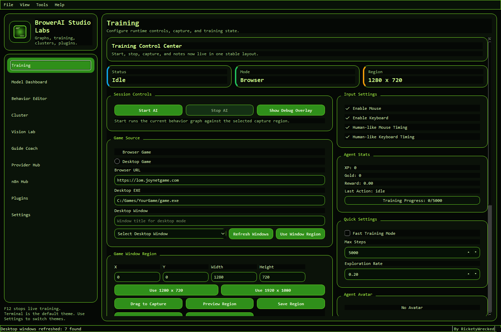
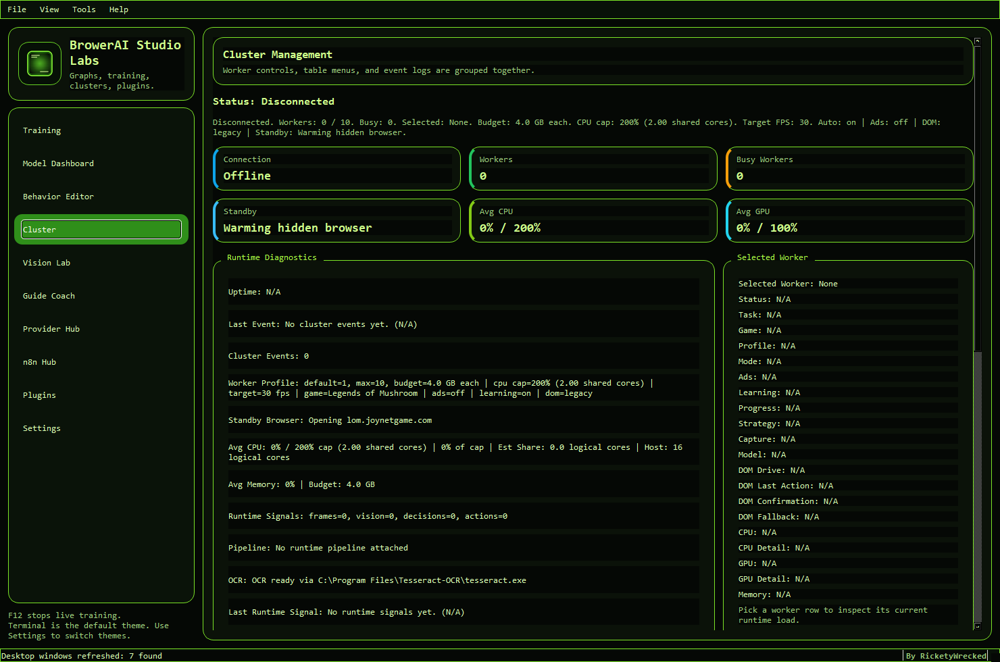
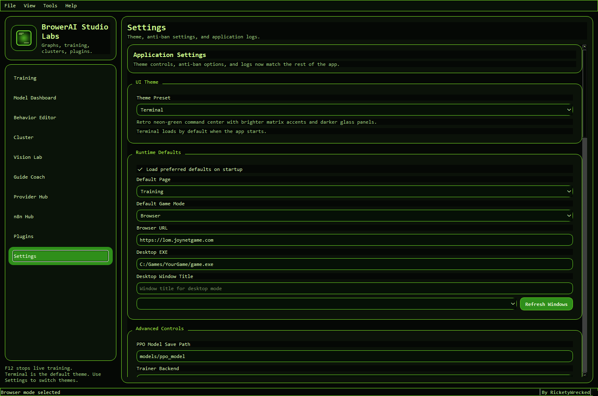

# BrowerAI Studio Labs

[](https://github.com/HardStyleMoose/browser-ai-studio-github-ready/releases)
[](https://github.com/HardStyleMoose/browser-ai-studio-github-ready/actions/workflows/codeql.yml)
[](https://github.com/HardStyleMoose/browser-ai-studio-github-ready/actions/workflows/security.yml)
[](LICENSE.md)

BrowerAI Studio Labs is a desktop automation and training workspace for browser and desktop games. It combines a PySide6 UI, a visual behavior graph editor, screen capture, OCR, model/training controls, plugin support, cluster-style worker management, and a safe vision-analysis module in one application.

This repository is public for source visibility and evaluation, but it is **not open source**. Use is governed by the proprietary terms in [LICENSE.md](LICENSE.md), and packaged installs are governed by [EULA.md](EULA.md).

## Screenshots


_Main app shell in the default Terminal theme, with the training workspace active._

| Training | Cluster | Settings |
| --- | --- | --- |
|  |  |  |
| Runtime controls, capture region setup, agent stats, and quick-start actions. | Worker status, standby prewarm state, runtime diagnostics, and selected-worker details. | Theme selection, runtime defaults, and application-level configuration controls. |

## Current App Sections

- `Training`
  - game mode, URL/EXE, capture region, AI start/stop, input settings, logs, notes
- `Model Dashboard`
  - charts, metrics, PPO controls, runtime details
- `Behavior Editor`
  - node graph editor, logs/minimap inspector, background tools, save/load/history/simulate actions
- `Cluster`
  - worker controls, runtime diagnostics, selected-worker details, worker budget settings
- `Vision Lab`
  - safe capture analysis, OCR review, target ranking, presets, session history, heatmaps, dataset tools
- `Guide Coach`
  - replay diagnostics, click calibration, focus-mask review, progression checklist, and offline replay scoring
- `Provider Hub`
  - provider catalog, compatible endpoint profiles, prompt lab, and health notes
- `n8n Hub`
  - local n8n runtime management, editor mode selection, workflow templates, and run summaries
- `Plugins`
  - loaded plugin inventory, refresh/reload, selected plugin details
- `Settings`
  - theme, runtime defaults, cluster defaults, OCR status, anti-ban settings, save/reload/reset actions

## What The Project Does

- visual behavior design through a drag-and-drop graph editor
- browser and desktop capture/training workflows
- OCR and UI/object-detection-assisted state understanding
- PPO model loading, saving, and training controls
- plugin-based extension points
- cluster-style worker monitoring and control
- safe vision analysis tooling through Vision Lab

## Key Runtime Notes

- App/window title: `BrowerAI Studio Labs`
- Default theme: `Terminal`
- Author label in the UI: `RicketyWrecked`
- Active main window implementation: `ui/main_window_fixed.py`
- Active graph editor implementation: `ui/node_editor_fixed.py`
- `ui/main_window.py` is only a thin export of the active fixed window
- Browser-worker startup now auto-checks Playwright Chromium and attempts a first-run install if it is missing

## Requirements

- Python `3.8+`
- Windows is the primary tested desktop target
- Tesseract installed for OCR features
- dependencies from `requirements.txt`

Main packages currently used include:

- `pyside6`
- `opencv-python`
- `torch`
- `ultralytics`
- `numpy`
- `pytesseract`
- `mss`
- `pynput`
- `stable-baselines3`
- `gymnasium`

## Licensing And Security

The repo and packaged application now include a full legal and security bundle:

- [LICENSE.md](LICENSE.md)
- [EULA.md](EULA.md)
- [NOTICE.md](NOTICE.md)
- [THIRD_PARTY_NOTICES.md](THIRD_PARTY_NOTICES.md)
- [SECURITY.md](SECURITY.md)
- [CONTRIBUTING.md](CONTRIBUTING.md)

Baseline hardening in the project now includes:

- env-var-only secret references for provider and local-runtime APIs
- loopback-only defaults for the managed `n8n` runtime
- provider endpoint validation that allows `https://...` and loopback URLs only by default
- packaged release manifests with payload and legal-document SHA256 hashes
- installer-side payload verification before extraction

See [.env.example](.env.example) for supported environment-variable patterns.

Important compliance note: [THIRD_PARTY_NOTICES.md](THIRD_PARTY_NOTICES.md) currently flags `ultralytics` as an `AGPL-3.0` review item. Review that dependency carefully before public redistribution.

## Installation

1. Clone the repository.
2. Create a virtual environment:

```powershell
python -m venv env
```

3. Activate it:

```powershell
.\env\Scripts\activate
```

4. Install dependencies:

```powershell
pip install -r requirements.txt
```

## Running The App

From `D:\IDLE RPG`:

```powershell
.\env\Scripts\python.exe "AI Agents\browser-ai-studio\app\main.py"
```

No-console path:

```powershell
.\env\Scripts\pythonw.exe "AI Agents\browser-ai-studio\app\main.pyw"
```

## Building A Setup Wizard

To build the packaged app plus the branded setup wizard:

```powershell
.\env\Scripts\python.exe "AI Agents\browser-ai-studio\build_exe.py"
```

You can also start that build without opening a terminal by double-clicking:

- `AI Agents\browser-ai-studio\Build BrowerAI Studio Labs Installer.vbs`

That build produces:

- `dist/BrowserAI_Lab/`
  - the packaged application folder
- `dist/BrowerAI Studio Labs Setup.exe`
  - the GUI installer wizard with install-path selection, shortcut creation, Chromium setup, and post-install launch support

Packaged builds also bundle the legal/security docs and emit release-manifest integrity metadata including `payload_sha256`, `eula_sha256`, and `notice_sha256`.

## Quick Start

1. Launch the app.
2. Configure the game source and region in `Training`.
3. Build or load a graph in `Behavior Editor`.
4. Tune defaults in `Settings`.
5. Use `Cluster` if you want multi-worker monitoring/control.
6. Use `Vision Lab` for safe frame analysis, OCR review, dataset capture, and benchmarking.

## Cluster Defaults

The current UI supports configurable cluster defaults:

- default worker count: `1`
- maximum worker count: `10`
- default memory budget per worker: `4.0 GB`
- default worker target FPS: `30`

Each worker record in the Cluster page now tracks:

- worker id
- status
- task
- game
- mode
- CPU usage
- memory usage
- capture region
- model/checkpoint summary
- training progress summary

The current cluster page is a control and monitoring surface. It is not a full distributed scheduler by itself.

## Vision Lab

Vision Lab is the project's safe advanced analysis module. It is intended for:

- screen-region analysis
- OCR inspection
- UI/object detection review
- target ranking for analysis only
- backend benchmarking
- dataset capture/export
- recorded image/video review
- session history export
- heatmap generation
- preset profiles

It is not intended to directly drive gameplay input from that page.

## Plugin System

Plugins are loaded from the `plugins/` folder by `core/plugin_manager.py`.

Current runtime plugin API:

- inherit from `core.plugin_interface.BasePlugin`
- implement `activate(context)`
- optionally implement `deactivate(context)`

Plugin summaries shown in the UI currently include:

- id
- name
- version
- description

See:

- `plugins/README.md`
- `plugins/example_plugin.py`

## Architecture Snapshot

- `UI Layer`
  - main window, behavior editor, dashboards, settings
- `Automation Layer`
  - input manager, action execution, anti-ban timing
- `Vision Layer`
  - screen capture, OCR, UI detection, dataset capture
- `AI Layer`
  - PPO trainer and environment wiring
- `Integration Layer`
  - config manager, event bus, plugin manager, pipeline controller

## Important Files

- `app/main.py`
  - main startup path
- `app/main.pyw`
  - no-console entrypoint
- `ui/main_window_fixed.py`
  - active main window and pages
- `ui/behavior_editor.py`
  - behavior editor wrapper
- `ui/node_editor_fixed.py`
  - active graph editor
- `vision/resource_reader.py`
  - OCR/Tesseract status logic
- `vision/screen_capture.py`
  - capture utilities
- `core/config_manager.py`
  - settings persistence
- `core/plugin_manager.py`
  - plugin discovery/load/unload
- `config/settings.yaml`
  - persisted defaults

## Additional Documentation

For a cleaner future-reference summary of the current project state, see:

- `PROJECT_CONTEXT.md`
- `distributed/README.md`
- `plugins/README.md`

## Troubleshooting

### App will not start

- verify the virtual environment is active
- verify dependencies are installed
- verify the path with spaces is quoted when launching manually

### OCR is unavailable

- install Tesseract
- confirm the executable is visible to the app
- check OCR status in `Settings` or `Cluster`

### Vision features are limited

- some acceleration backends such as ONNX/TensorRT/OBS depend on optional packages
- if those packages are missing, the UI will fall back to available capabilities

### Cluster settings seem wrong

- worker defaults are controlled from `Settings`
- disconnect/reconnect the cluster after changing defaults if you want a fresh worker set

### Legal or installer questions

- packaged installs require acceptance of the bundled EULA in the setup wizard
- the installer verifies payload integrity before extraction
- the installed manifest records accepted legal metadata and release hashes

## Documentation Status

This README is intentionally a current-state summary. Some older repo docs describe earlier UI layouts or older interface names. When sources disagree, prefer:

1. `PROJECT_CONTEXT.md`
2. current code in `ui/main_window_fixed.py`
3. this README
